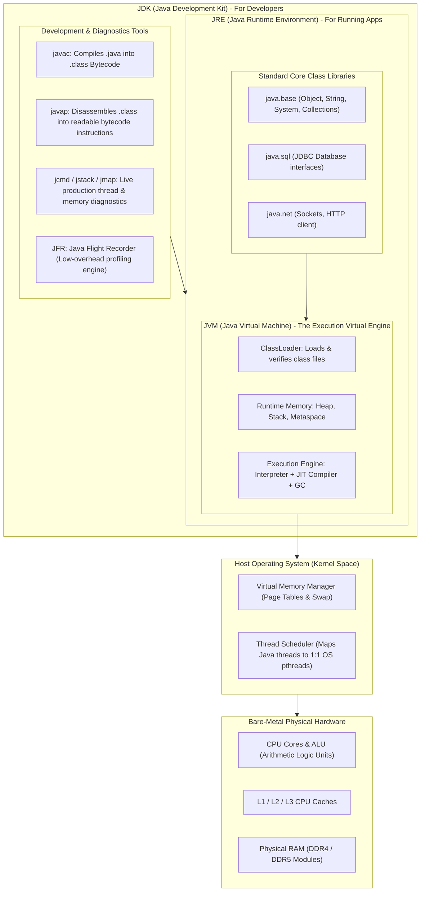
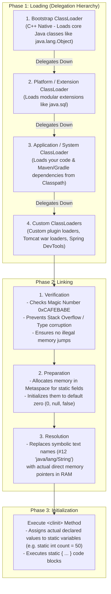
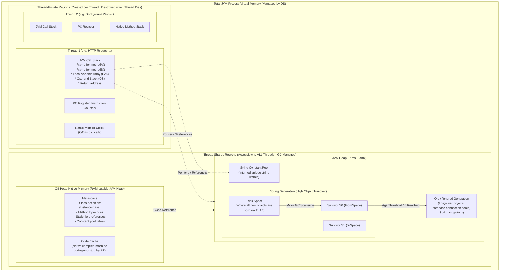
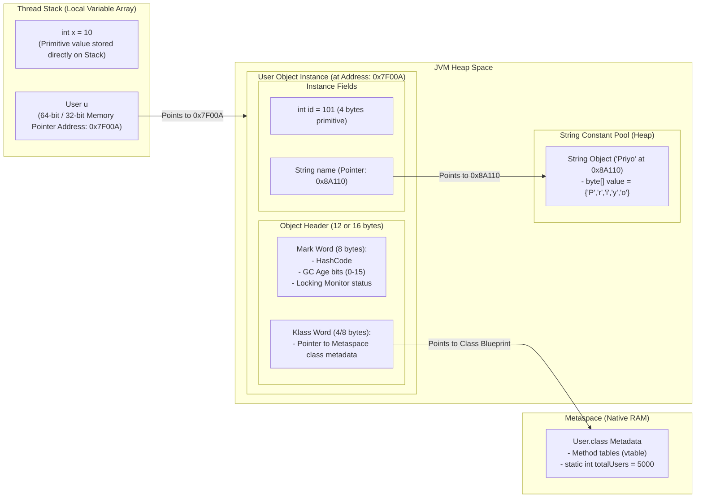
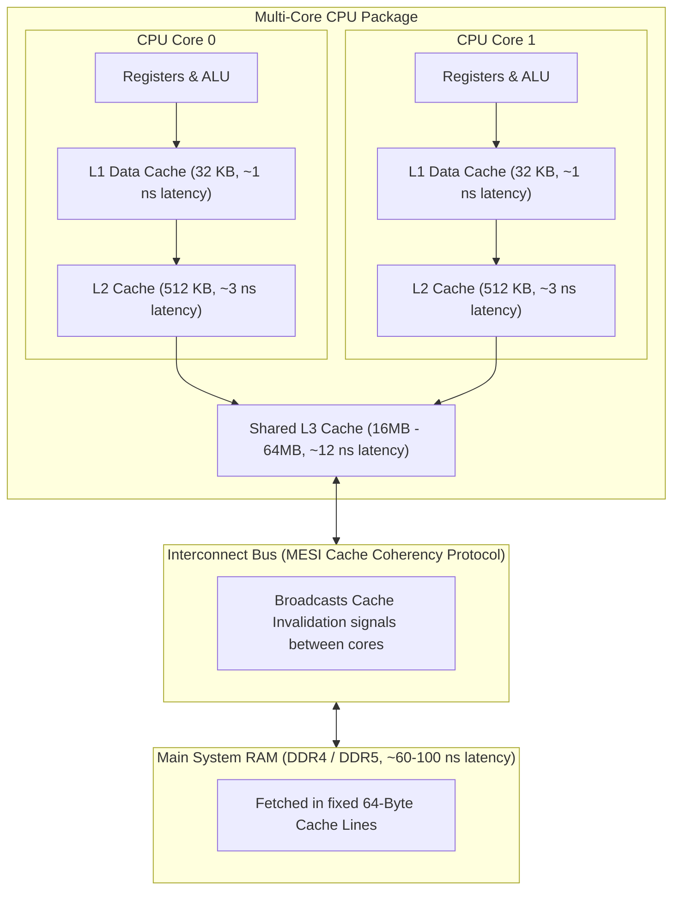
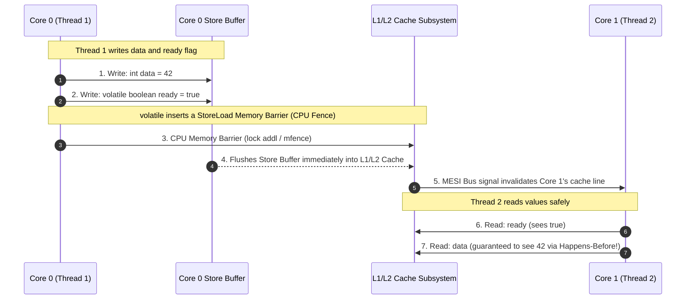
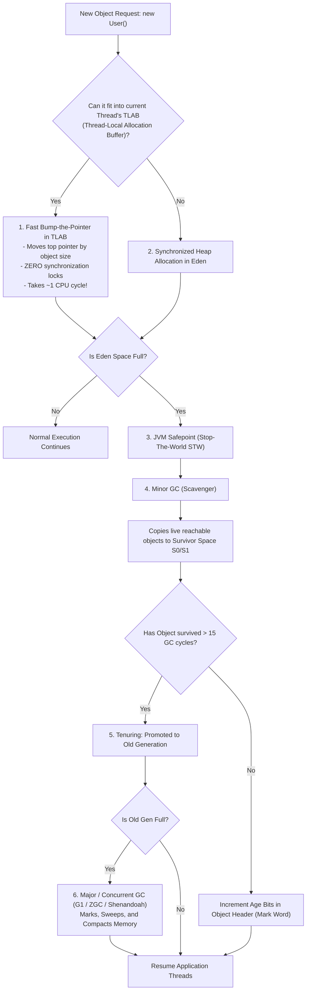
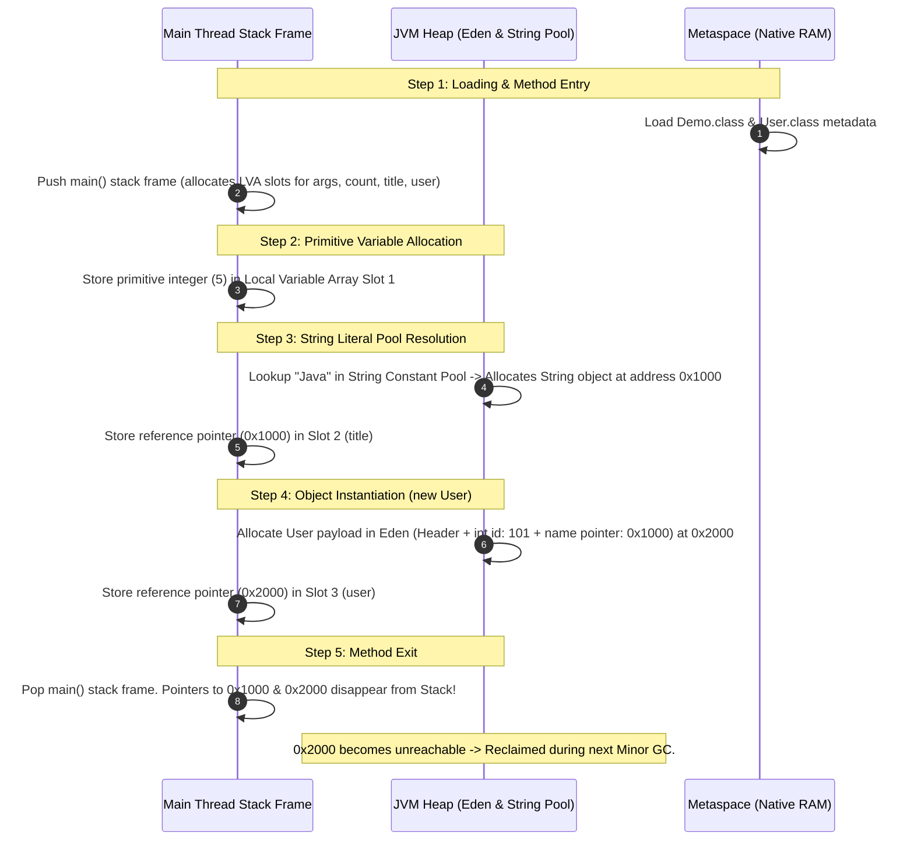

# Under the Hood: JVM Architecture, Memory Model & Hardware-Level Deep Dive
**Author:** decodewithpriyo  
**Target Level:** Senior Software Engineer (SWE 4 / Staff Systems Engineer) & Deep Learner  
**Scope:** Plain-English Explanations, Intuitive Analogies, Visual Mermaid Diagrams, Hardware Mechanics, and Step-by-Step Memory Traces

---

## Table of Contents
1. [JDK vs JRE vs JVM: The Complete Stack Explained](#1-jdk-vs-jre-vs-jvm-the-complete-stack-explained)
2. [The ClassLoader Subsystem: How Classes Are Loaded & Verified](#2-the-classloader-subsystem-how-classes-are-loaded--verified)
3. [The Execution Engine: Interpreter, JIT Compilers & HotSpot Optimizations](#3-the-execution-engine-interpreter-jit-compilers--hotspot-optimizations)
4. [JVM Runtime Memory Areas: Where Does Everything Go?](#4-jvm-runtime-memory-areas-where-does-everything-go)
5. [Anatomy of an Object & Where Variables Live](#5-anatomy-of-an-object--where-variables-live)
6. [Hardware Level: CPU Caches, 64-Byte Cache Lines & False Sharing](#6-hardware-level-cpu-caches-64-byte-cache-lines--false-sharing)
7. [The Java Memory Model (JMM), Volatile & Memory Barriers](#7-the-java-memory-model-jmm-volatile--memory-barriers)
8. [Garbage Collection & TLAB: How Memory Is Allocated and Reclaimed](#8-garbage-collection--tlab-how-memory-is-allocated-and-reclaimed)
9. [Step-by-Step Code Walkthrough: Tracing Memory Line by Line](#9-step-by-step-code-walkthrough-tracing-memory-line-by-line)

---

## 1. JDK vs JRE vs JVM: The Complete Stack Explained

### 💡 The Big Picture Analogy
Think of building a car:
* **JDK (The Factory & Toolset):** The wrenches, blueprints, diagnostic computers, and robotic welders needed to build the car from raw metal.
* **JRE (The Fuel & Operating Package):** The roads, road rules, spare tires, and engine fluids needed to run the car anywhere.
* **JVM (The Engine):** The actual combustion engine that converts fuel into mechanical movement on the physical wheels.



### Detailed Component Explanations:
1. **`javac` (Compiler):** Does **not** produce machine code (0s and 1s for Intel/AMD/Apple Silicon). Instead, it translates human-readable `.java` syntax into intermediate, platform-independent **Java Bytecode** (`.class` files).
2. **`javap` (Disassembler):** A command-line tool that lets you inspect the raw bytecode, constant pool tables, and operand stack instructions inside any `.class` file (`javap -c -v MyClass.class`).
3. **Core Libraries (`java.base`):** Pre-compiled runtime classes provided by Java (such as `java.lang.String`, `java.util.ArrayList`, `java.lang.Thread`).
4. **JVM (Virtual Machine):** Emulates a physical CPU in software. It reads bytecode instructions (e.g., `iload_1`, `iadd`, `invokevirtual`) and translates them into physical CPU machine instructions on Windows, Linux, or macOS.

---

## 2. The ClassLoader Subsystem: How Classes Are Loaded & Verified

When your code says `new User()`, the JVM does not load the entire world at once. It loads classes **dynamically on-demand**.



### Why Delegation Hierarchy Matters:
* **Security Principle:** When `Application ClassLoader` is asked to load `java.lang.String`, it first delegates up to `Platform` and `Bootstrap`. Bootstrap loads the official JDK `String` from `java.base`.
* This prevents malicious code from creating a rogue `java.lang.String` or `java.lang.System` to hijack your application.

### The Magic Number (`0xCAFEBABE`):
* Every single compiled `.class` file in the universe starts with the 4-byte hexadecimal sequence `CA FE BA BE`. 
* During the **Verification** step, the JVM immediately rejects any file that does not start with these 4 bytes, guarding against corrupt or non-bytecode files.

---

## 3. The Execution Engine: Interpreter, JIT Compilers & HotSpot Optimizations

How does Java achieve C++ like speed after starting out as bytecode? Through **Tiered Compilation**.

```mermaid
flowchart TD
    Bytecode["Java Bytecode (.class file)"] --> Interpreter["Tier 0: Interpreter<br/>- Starts executing instantly line-by-line<br/>- Zero compilation delay<br/>- Tracks method execution counters"]
    
    Interpreter -->|Method called > 2,000 times| C1["Tier 1-3: C1 Client Compiler<br/>- Fast compilation with basic optimizations<br/>- Emits native machine code quickly"]
    
    C1 -->|Method called > 10,000 times ('Hot Spot')| C2["Tier 4: C2 Server Compiler<br/>- Heavy mathematical optimizations<br/>- Deep profiling & aggressive restructuring"]
    
    subgraph JITOptimizations["C2 Deep Optimizations"]
        Inlining["1. Method Inlining<br/>(Copies method body directly into caller to remove stack frame overhead)"]
        Escape["2. Escape Analysis (EA)<br/>- Scalar Replacement: Allocates object fields directly in CPU registers / Stack!<br/>- Lock Elision: Removes unnecessary synchronized locks"]
        Vector["3. SIMD Auto-Vectorization<br/>(Processes 4 to 8 array elements simultaneously using AVX/SSE CPU instructions)"]
    end

    C2 --> JITOptimizations
    JITOptimizations --> CodeCache["Code Cache (Native x86_64 / ARM64 Machine Code)"]
    CodeCache --> CPU["Direct Bare-Metal Execution on CPU ALU"]
    
    CodeCache -.->|Assumptions Invalidated (Deoptimization)| Interpreter
```

### Key JIT Terminology Explained:
1. **Interpreter:** Executes bytecode line-by-line. Very fast to start, but slower in long-running loops because it translates the same instruction repeatedly.
2. **JIT (Just-In-Time) Compiler:** Compiles frequently used bytecode ("hot spots") directly into native CPU assembly language while the program is running.
3. **Method Inlining:** If you call a tiny helper method like `int add(a, b) { return a + b; }` a million times in a loop, C2 replaces the call instruction with `a + b` directly, removing the cost of pushing and popping stack frames.
4. **Escape Analysis & Scalar Replacement:**
   * If C2 determines an object never escapes outside the current method (e.g., `Point p = new Point(x, y);`), it **does not allocate it on the Heap**.
   * Instead, it decomposes `Point` into two primitive variables (`x` and `y`) stored directly in **CPU registers or the Stack**, producing **zero garbage collection overhead!**

---

## 4. JVM Runtime Memory Areas: Where Does Everything Go?

The JVM partitions memory into **Thread-Shared** areas (accessible to all threads) and **Thread-Private** areas (exclusive to each thread).



### Summary of Each Memory Region:

| Memory Region | Thread Scope | What It Stores | Lifetime |
| :--- | :--- | :--- | :--- |
| **JVM Stack** | Thread-Private | Stack frames, local primitive variables, method arguments, reference pointers. | Lifetime of the thread/method call. |
| **PC Register** | Thread-Private | Address of the current bytecode instruction being executed by that thread. | Lifetime of the thread. |
| **Native Stack** | Thread-Private | State for native C/C++ methods called via JNI (Java Native Interface). | Lifetime of native execution. |
| **JVM Heap** | Thread-Shared | All class instances (objects), arrays, instance fields, and the String Constant Pool. | Managed by Garbage Collector. |
| **Metaspace** | Thread-Shared | Class metadata, method bytecodes, static variables, runtime constant pools. | Lives until the ClassLoader unloads. |
| **Code Cache** | Thread-Shared | Compiled native machine code emitted by C1/C2 JIT compilers. | Application runtime. |

---

## 5. Anatomy of an Object & Where Variables Live

When you write `User u = new User(101, "Priyo");`, what does memory actually look like?



### Where Does Each Type of Variable Live?
1. **Local Primitives (`int age = 20;` inside a method):** Stored directly inside the **Stack Frame's Local Variable Array**. Destroyed as soon as the method finishes.
2. **Local Object Reference (`User u = new User();`):** The reference variable `u` (the pointer address) is on the **Stack Frame**. The actual `User` object data lives on the **Heap**.
3. **Instance Variables (`int id;` inside `User` class):** Stored inside the **Heap** as part of the object's body.
4. **Static Variables (`static int totalCount;`):** Stored on the **Heap** attached to the `java.lang.Class` mirror object (in Java 8+, metadata in Metaspace).
5. **String Literals (`"Priyo"`):** Stored in the **String Constant Pool** on the Heap so duplicate strings share the exact same memory address.

---

## 6. Hardware Level: CPU Caches, 64-Byte Cache Lines & False Sharing

Modern CPUs are thousands of times faster than main RAM. To avoid waiting for RAM, CPUs use ultra-fast on-die **SRAM Caches (L1, L2, L3)**.



### 1. What is a 64-Byte Cache Line?
* The CPU **never** fetches a single byte or single integer from RAM.
* It always fetches a continuous chunk of **64 bytes** called a **Cache Line**.
* If you read an array element `arr[0]`, the CPU automatically loads `arr[0]` through `arr[15]` into L1 cache for free!

### 2. What is False Sharing?
* Suppose `Thread 1` on Core 0 modifies `long x`, and `Thread 2` on Core 1 modifies `long y`.
* If `x` and `y` sit adjacent to each other in memory, they land inside the **same 64-byte cache line**.
* Whenever Core 0 updates `x`, hardware cache coherency (**MESI Protocol**) invalidates the entire cache line on Core 1, forcing Core 1 to stall and re-fetch from L3 cache even though it never touched `x`!
* **Java Fix:** `@Contended` pads 128 bytes of empty space around variables to ensure they occupy separate cache lines.

### 3. What are Compressed OOPs (Ordinary Object Pointers)?
* On 64-bit operating systems, pointers normally take 8 bytes (64 bits).
* The JVM uses a trick called **Compressed OOPs** (`-XX:+UseCompressedOops`):
  * Since all Java objects are aligned to 8-byte boundaries in memory, the last 3 bits of every object's memory address are always `000`.
  * The JVM drops the 3 zero bits and stores pointers as **32-bit integers**.
  * When dereferencing, the CPU shifts it left by 3 bits:
    $$\text{Physical 64-bit Address} = \text{32-bit Pointer} \ll 3$$
  * This saves ~40% cache space while addressing up to $2^{32} \times 8 = 32\text{ GB}$ of Heap!

---

## 7. The Java Memory Model (JMM), Volatile & Memory Barriers

CPUs and compilers aggressively reorder instructions for performance. In multi-threaded programs, this causes subtle concurrency bugs.



### What `volatile` Does Under the Hood:
1. **Prevents Reordering:** Tells the `javac` compiler and CPU out-of-order execution engine not to reorder instructions across the volatile read/write barrier.
2. **Inserts Hardware Memory Fences:**
   * Emits an x86 `lock` instruction or `mfence` assembly instruction.
   * Forces Core 0's private **Store Buffer** to flush pending writes to the L1 cache immediately.
   * Forces Core 1's cache line to refresh, guaranteeing **instant visibility** across threads.

---

## 8. Garbage Collection & TLAB: How Memory Is Allocated and Reclaimed

How can Java allocate millions of objects per second without locking up memory?



### Key GC Concepts:
1. **TLAB (Thread-Local Allocation Buffer):** Each thread is given a private slice of Eden space. New objects are allocated using a single CPU pointer increment (**Bump-the-Pointer**) without acquiring global memory locks.
2. **Weak Generational Hypothesis:** 95%+ of Java objects die almost immediately (temporary strings, loop counters, short DTOs). Minor GC quickly wipes dead objects from Eden and copies only the few live ones to Survivor space.
3. **Card Table & Remembered Sets (RSet):** When Minor GC runs, it does not scan the massive Old Generation. It uses an internal byte array (Card Table) where the JVM marks a 512-byte block "dirty" whenever an Old Gen object points to a Young Gen object.

---

## 9. Step-by-Step Code Walkthrough: Tracing Memory Line by Line

Let us trace what happens in CPU registers, Stack Frames, Heap, and Metaspace for this simple snippet:

```java
public class Demo {
    public static void main(String[] args) {
        int count = 5;
        String title = "Java";
        User user = new User(101, title);
    }
}
```



---

## 🛠️ Senior Engineer Diagnostic Commands

```bash
# 1. Inspect Bytecode instructions & Constant Pool entries
javap -v -p -c src/com/decodewithpriyo/basics/Main.class

# 2. View JIT Assembly output on physical CPU (requires hsdis plugin)
java -XX:+UnlockDiagnosticVMOptions -XX:+PrintAssembly com.decodewithpriyo.basics.Main

# 3. Print all JVM Ergonomic Defaults and Memory Flags
java -XX:+PrintFlagsFinal -version | grep -iE 'heapsize|compressedoops|metaspace'

# 4. Stream real-time GC events with microsecond precision
java -Xlog:gc*,gc+phases=debug:file=gc.log:time,uptime,pid:filecount=5,filesize=100M
```
