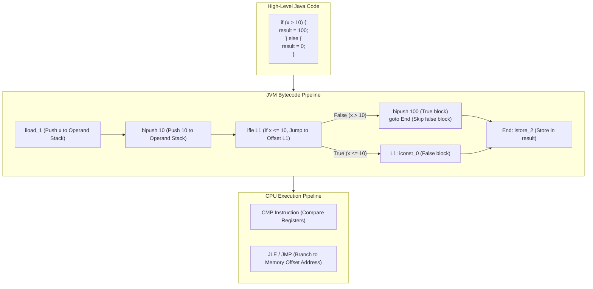
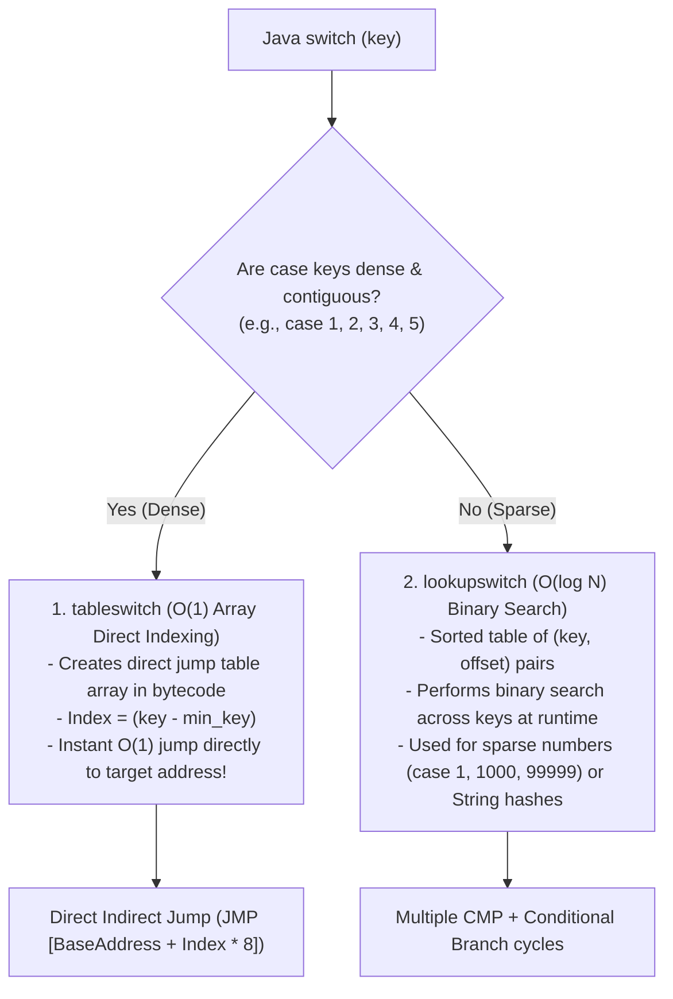
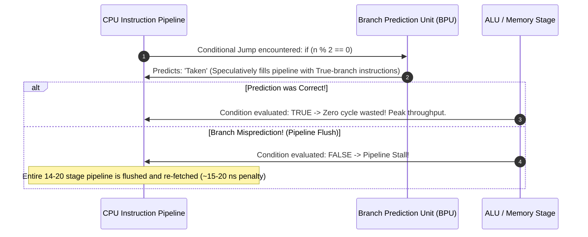
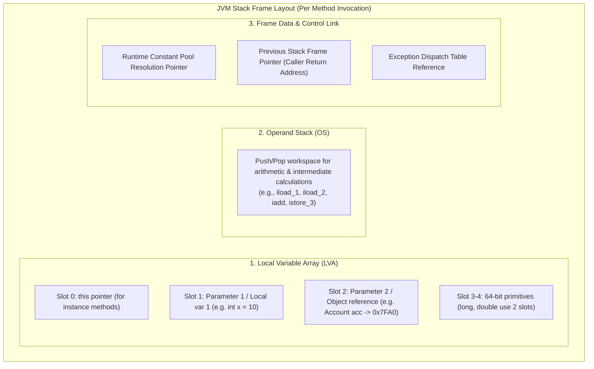
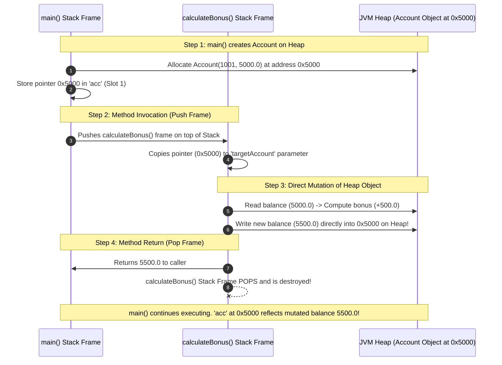
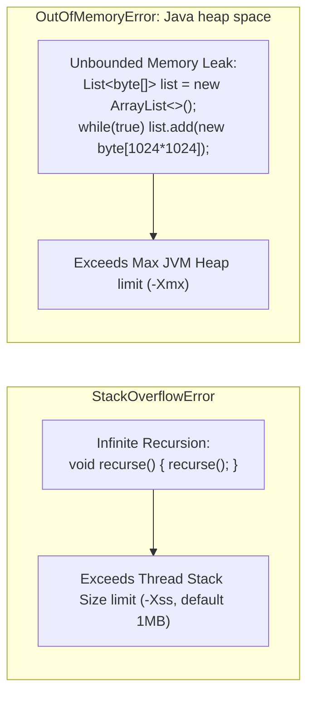

# Control Flow, Methods & Stack vs Heap: Senior SWE 4 Deep Dive
**Author:** decodewithpriyo  
**Target Level:** Senior Software Engineer / Staff Systems Engineer  
**Scope:** Bytecode Branching, Jump Tables (`tableswitch` vs `lookupswitch`), CPU Branch Prediction, Stack Frame Activation Records, and Memory Management

---

## Table of Contents
1. [Control Flow at the Hardware & Bytecode Level](#1-control-flow-at-the-hardware--bytecode-level)
2. [Switch Internals: `tableswitch` (O(1)) vs `lookupswitch` (O(log N))](#2-switch-internals-tableswitch-o1-vs-lookupswitch-olog-n)
3. [CPU Branch Prediction & Pipeline Stalls](#3-cpu-branch-prediction--pipeline-stalls)
4. [Anatomy of a Stack Frame (Activation Record)](#4-anatomy-of-a-stack-frame-activation-record)
5. [Step-by-Step Method Invocation Memory Trace](#5-step-by-step-method-invocation-memory-trace)
6. [StackOverflowError vs OutOfMemoryError](#6-stackoverflowerror-vs-outofmemoryerror)

---

## 1. Control Flow at the Hardware & Bytecode Level

In high-level Java, conditionals (`if-else`, loops) look like human decisions. At the bytecode and CPU hardware level, they compile down to **Comparison Instructions + Conditional Jumps (`goto`)**.

---

## 2. Switch Internals: `tableswitch` (O(1)) vs `lookupswitch` (O(log N))

The Java compiler optimizes switch statements by choosing between two distinct bytecode instructions depending on how dense or sparse the case keys are.

### Key Differences:

| Feature | `tableswitch` | `lookupswitch` |
| :--- | :--- | :--- |
| **Case Distribution** | Contiguous or tightly packed numbers (e.g. `1, 2, 3, 4`). | Sparse or disparate numbers (e.g. `1, 500, 100000`) and Strings. |
| **Time Complexity** | **$O(1)$** (Direct array index arithmetic). | **$O(\log N)$** (Binary search on sorted keys). |
| **Bytecode Footprint** | Larger (stores a jump target for every contiguous integer). | Compact (stores only defined case key-value pairs). |

---

## 3. CPU Branch Prediction & Pipeline Stalls

Modern CPU instruction pipelines (e.g., 14-20 stages deep) execute instructions speculatively.

> 💡 **Staff Engineer Tip:** Sorting an array *before* filtering in a loop (`if (arr[i] > 128)`) can speed up execution by **3x to 6x** because the Branch Predictor sees uniform consecutive True/False patterns!

---

## 4. Anatomy of a Stack Frame (Activation Record)

Every thread in the JVM has its own **Call Stack**. Whenever a method is called, a new **Stack Frame** is pushed on top.

---

## 5. Step-by-Step Method Invocation Memory Trace

Let us trace what happens when `main()` calls `calculateBonus(acc, 10.0)`:

---

## 6. StackOverflowError vs OutOfMemoryError

### Summary Comparison:

| Characteristic | `StackOverflowError` | `OutOfMemoryError: Java heap space` |
| :--- | :--- | :--- |
| **Location** | Thread Call Stack. | JVM Heap. |
| **Root Cause** | Deep or infinite method recursion exhausting stack frames. | Heap memory exhausted by live, unreachable-for-GC objects / memory leaks. |
| **JVM Configuration** | `-Xss` (e.g. `-Xss1m`). | `-Xmx` (e.g. `-Xmx4g`) & `-Xms`. |
| **Concurrency Impact** | Crashes only the offending thread. | Threatens entire JVM process stability. |
