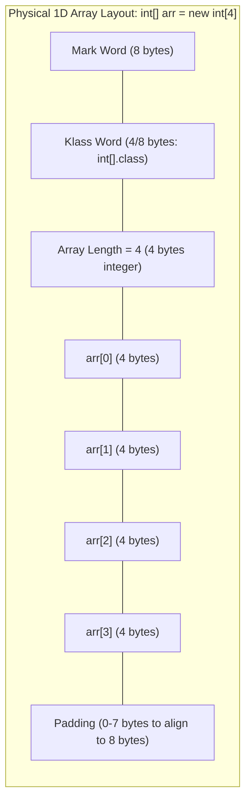
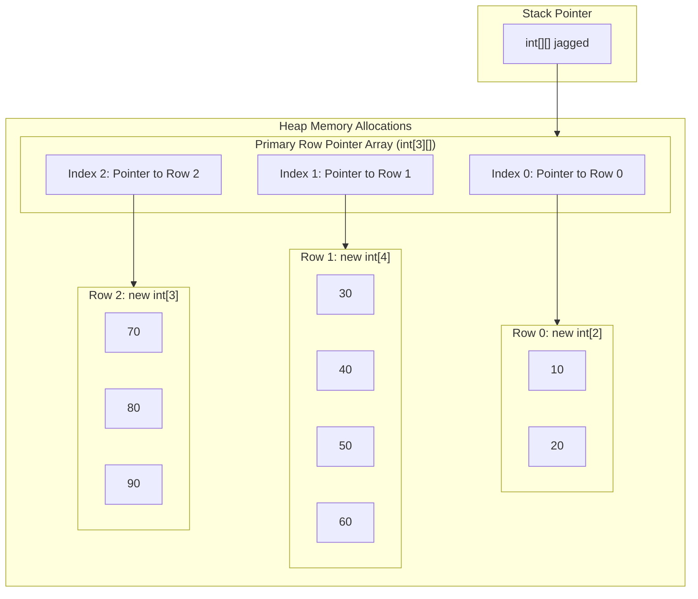
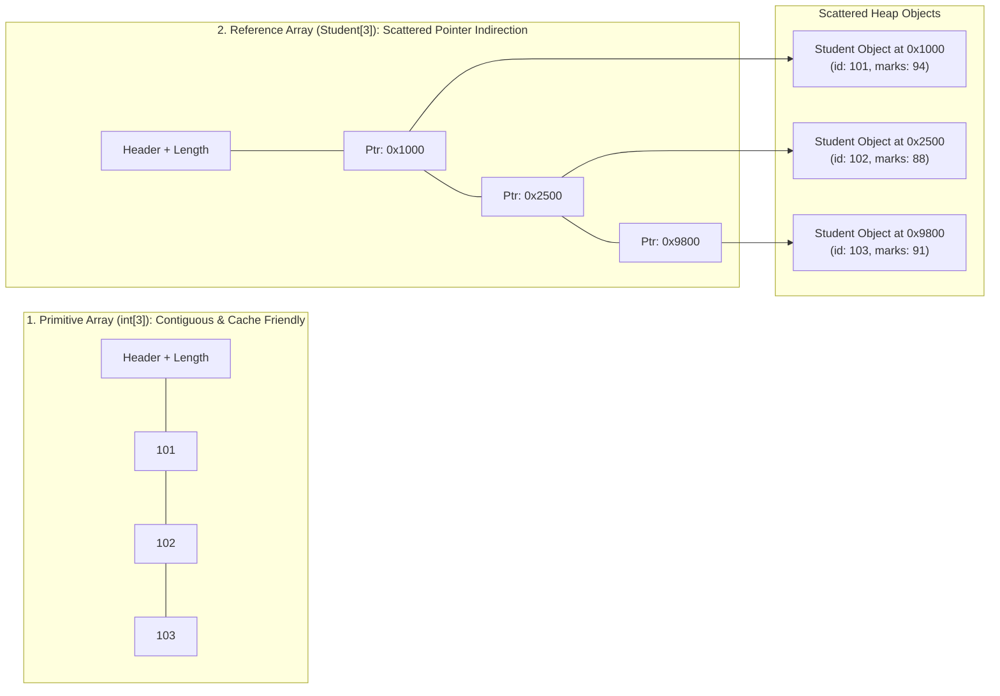
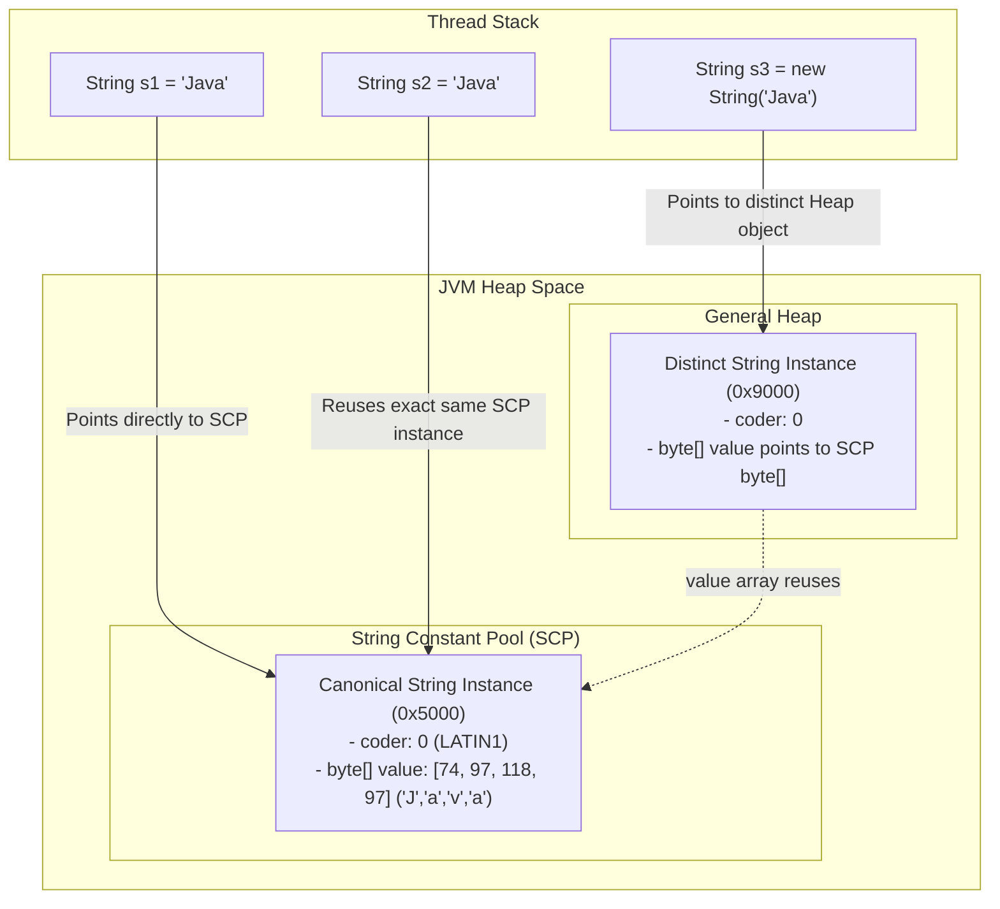
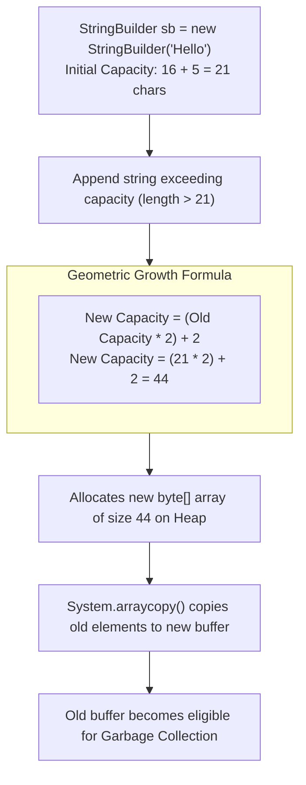

# Arrays, Strings & Memory Mechanics: Senior SWE 4 Deep Dive
**Author:** decodewithpriyo  
**Target Level:** Senior Software Engineer / Staff Systems Engineer  
**Scope:** Contiguous Memory Layouts, Spatial Locality, Cache Pre-fetching, Compact Strings (Java 9+), String Constant Pool, and Buffer Resizing

---

## Table of Contents
1. [Physical Memory Anatomy of a Java Array](#1-physical-memory-anatomy-of-a-java-array)
2. [Multi-Dimensional & Jagged Arrays in Memory](#2-multi-dimensional--jagged-arrays-in-memory)
3. [Primitive Array vs Reference Array (Memory & Cache Locality)](#3-primitive-array-vs-reference-array-memory--cache-locality)
4. [String Constant Pool (SCP) & Compact Strings (Java 9+)](#4-string-constant-pool-scp--compact-strings-java-9)
5. [StringBuilder Dynamic Buffer Expansion Formula](#5-stringbuilder-dynamic-buffer-expansion-formula)

---

## 1. Physical Memory Anatomy of a Java Array

In Java, an array is an **Object** allocated dynamically on the Heap with a specialized contiguous memory structure.

### Why Array Indexing is Mathematically $O(1)$:
Because memory is strictly contiguous, the CPU calculates the exact physical RAM address of any index in a single arithmetic clock cycle without searching:

$$\text{Address}(\text{arr}[i]) = \text{Base Address} + \text{Header Size} + (i \times \text{Element Size})$$

* **Hardware Advantage (Spatial Locality):** When `arr[0]` is read, the CPU Memory Controller loads the entire **64-byte Cache Line** into L1 cache, pulling `arr[1]` through `arr[15]` into the CPU cache for free!

---

## 2. Multi-Dimensional & Jagged Arrays in Memory

In Java, multi-dimensional arrays are **not** contiguous 2D flat memory blocks (unlike C/C++). They are **Arrays of Reference Pointers**.

---

## 3. Primitive Array vs Reference Array (Memory & Cache Locality)

A critical performance difference exists between `int[]` and `Student[]`:

> ⚠️ **Performance Impact:** Traversing `int[]` triggers sequential cache hits. Traversing `Student[]` causes **Pointer Indirection & Potential Cache Misses** because objects can be scattered across non-contiguous Heap addresses.

---

## 4. String Constant Pool (SCP) & Compact Strings (Java 9+)

### Evolution of String Internal Storage:
* **Java 8 and earlier:** Strings used `char[]` (UTF-16 encoding, 2 bytes per character). Even simple ASCII text `"hello"` consumed 10 bytes of payload memory!
* **Java 9+ (Compact Strings Optimization):**
  * Strings now use `byte[]` plus a 1-byte **`coder` flag**.
  * If the string contains only Latin-1 characters (ASCII), `coder = 0` and each character consumes only **1 byte**.
  * If special/Unicode characters exist, `coder = 1` and it uses 2 bytes per char (UTF-16).
  * **Result:** Slashes the Heap memory footprint of all Java enterprise applications by **~50%**!

---

## 5. StringBuilder Dynamic Buffer Expansion Formula

When a `StringBuilder` exceeds its allocated capacity, it dynamically doubles its internal buffer using native memory copying (`System.arraycopy`).

---

## 🚀 Key Takeaways for Senior Engineers
1. **Always pre-size Collections & StringBuilders:** If you know you are appending 1,000 items, write `new StringBuilder(1000)` to avoid multiple array allocation and `System.arraycopy` cycles!
2. **Favor Primitives for High-Performance Loops:** `int[]` out-performs `Integer[]` or `List<Integer>` by orders of magnitude due to zero boxing overhead and continuous CPU cache pre-fetching.
3. **Use `.equals()` for Content & `==` for Identity:** String interning (`.intern()`) enables $O(1)$ identity checks, but should be used judiciously to avoid saturating the String Table.
