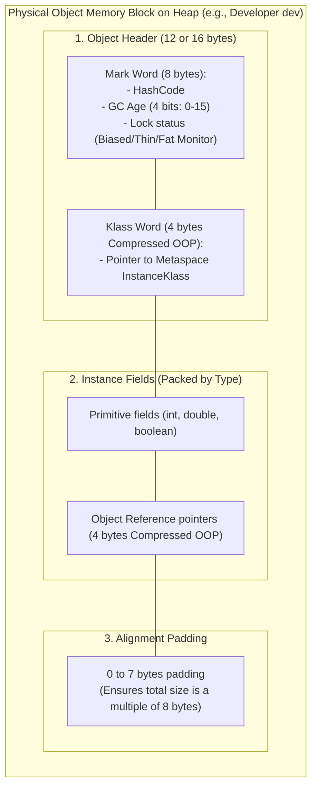
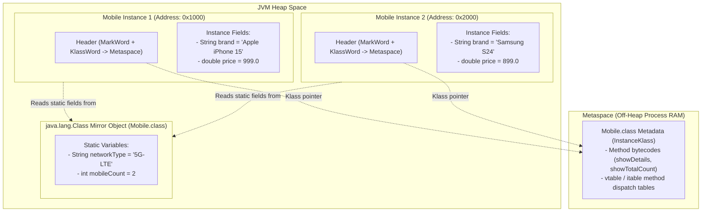
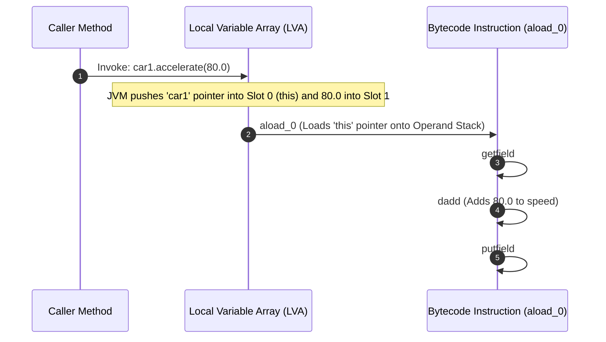
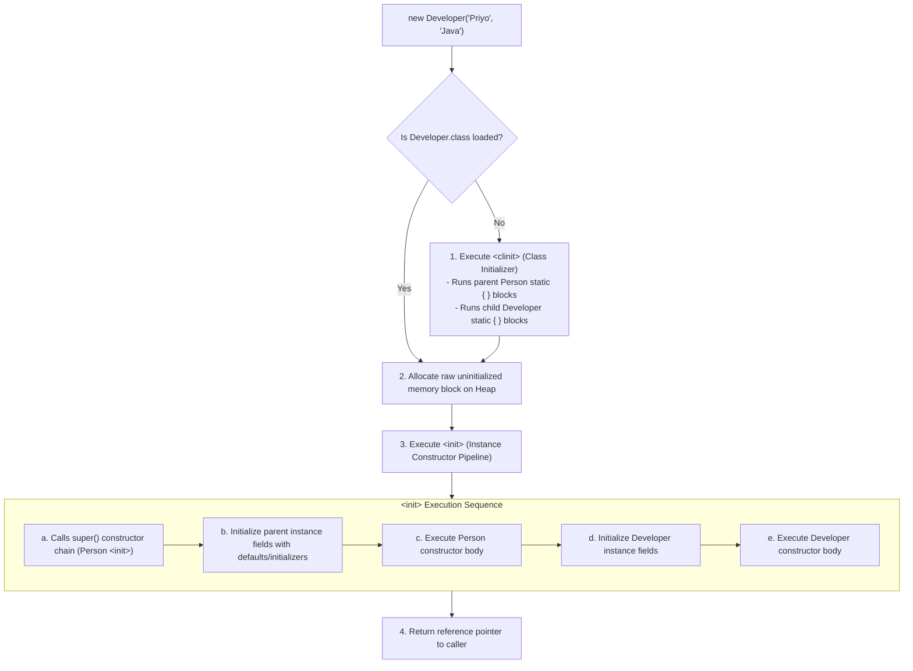

# OOP Fundamentals, Object Lifecycle & Memory Layout: Senior SWE 4 Deep Dive
**Author:** decodewithpriyo  
**Target Level:** Senior Software Engineer / Staff Systems Architect  
**Scope:** 64-bit Object Header Layout, Field Packing & Memory Padding, Static `<clinit>` vs `<init>` Lifecycle, `this` at Bytecode Level, and Constructor Chaining Execution Pipeline

---

## Table of Contents
1. [Physical 64-bit Object Memory Layout (HotSpot JVM)](#1-physical-64-bit-object-memory-layout-hotspot-jvm)
2. [Static Members vs Instance Members in Memory](#2-static-members-vs-instance-members-in-memory)
3. [The `this` Reference at Bytecode & CPU Register Level](#3-the-this-reference-at-bytecode--cpu-register-level)
4. [Constructor Execution Pipeline & Chaining Order (`<clinit>` vs `<init>`)](#4-constructor-execution-pipeline--chaining-order-clinit-vs-init)
5. [Encapsulation & Defensive Copying Architecture](#5-encapsulation--defensive-copying-architecture)

---

## 1. Physical 64-bit Object Memory Layout (HotSpot JVM)

Every Java object instantiated on the Heap conforms to a rigid 3-part binary structure aligned to **8-byte boundaries**.



### Field Reordering for Cache Optimization:
HotSpot reorders declared class fields to minimize padding gaps. It packs fields in this strict order:
1. `double` and `long` (8 bytes)
2. `int` and `float` (4 bytes)
3. `short` and `char` (2 bytes)
4. `byte` and `boolean` (1 byte)
5. Object References (`OOPs` - 4 bytes)

---

## 2. Static Members vs Instance Members in Memory



### Key Architectural Differences:
* **Instance Variables:** Stored independently inside each object's payload on the Heap. Allocating 1,000 objects creates 1,000 copies of instance fields.
* **Static Variables:** Stored once on the Heap attached to the `java.lang.Class` mirror. Allocating 1,000 objects shares a **single memory location**.

---

## 3. The `this` Reference at Bytecode & CPU Register Level

In Java bytecode, instance methods are simply static methods that receive an implicit hidden **0th parameter**: `this` (a reference pointer to the invoking object).



---

## 4. Constructor Execution Pipeline & Chaining Order (`<clinit>` vs `<init>`)

When you instantiate a sub-class: `new Developer("Priyo", "Java")`:



---

## 5. Encapsulation & Defensive Copying Architecture

Encapsulation is not just about making fields `private`. It is about guarding the object's **Internal State Boundaries**.

```mermaid
flowchart TB
    subgraph DangerZone["❌ Broken Encapsulation (Leaking Mutable References)"]
        Caller1["External Malicious / Buggy Caller"]
        InnerDate["Internal java.util.Date field inside Person"]
        Caller1 -->|Calls getDate -> Gets Direct Reference Pointer!| InnerDate
        Caller1 -->|Mutates Date directly in-place: date.setTime| InnerDate
        Note over InnerDate: Person's internal invariant is destroyed without its consent!
    end

    subgraph SafeZone["✅ True Encapsulation (Defensive Copying)"]
        Caller2["External Caller"]
        ProtectedDate["Internal Date field"]
        ClonedDate["Cloned Copy: new Date(internal.getTime())"]
        Caller2 -->|Calls getDate | ClonedDate
        ProtectedDate -.->|Cloned into| ClonedDate
        Caller2 -->|Mutates Cloned Copy| ClonedDate
        Note over ProtectedDate: Internal Person state remains 100% untouched and secure!
    end
```

---

## 🚀 Senior Engineer Rules of Thumb
1. **Always Favor Immutability & Constructor Injection:** Initialize all fields in constructor and declare fields `final` wherever possible.
2. **Beware of Static Memory Leaks:** Objects held in `static` collections (e.g. `static List<User> cache`) will **never be garbage collected** until the ClassLoader unloads.
3. **Use Fluent Method Chaining (`return this`):** Makes builder-pattern creation declarative, type-safe, and self-documenting.
