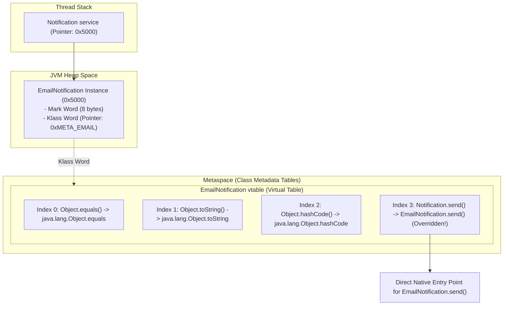
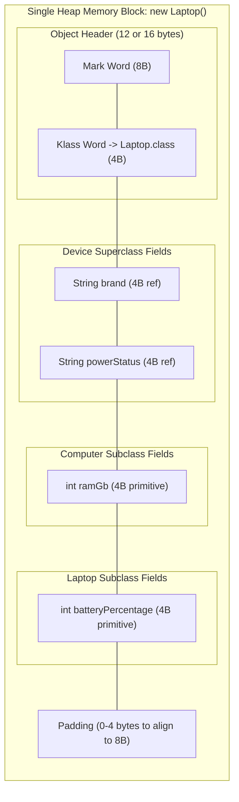
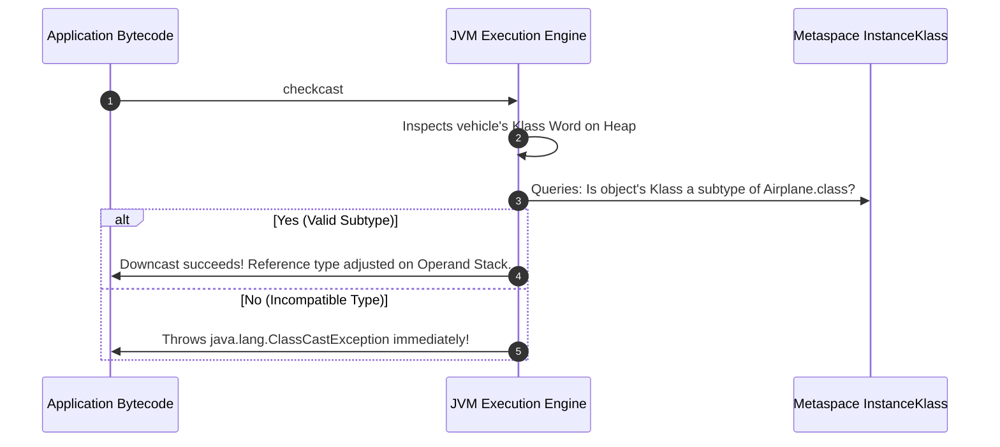

# Inheritance, Polymorphism & vtable Mechanics: Senior SWE 4 Deep Dive
**Author:** decodewithpriyo  
**Target Level:** Senior Software Engineer / Staff JVM Systems Architect  
**Scope:** Virtual Method Tables (`vtable`/`itable`), Bytecode Invocation Instructions (`invokevirtual`, `invokestatic`, `invokespecial`), Subclass Memory Packing, and Inner Class Memory Leaks

---

## Table of Contents
1. [Dynamic Method Dispatch & The `vtable` Architecture](#1-dynamic-method-dispatch--the-vtable-architecture)
2. [The 5 JVM Method Invocation Bytecodes](#2-the-5-jvm-method-invocation-bytecodes)
3. [Physical Memory Packing of Inherited Classes](#3-physical-memory-packing-of-inherited-classes)
4. [Runtime Type Identification & `checkcast` Mechanics](#4-runtime-type-identification--checkcast-mechanics)
5. [Inner Class Memory Architecture & Hidden Reference Leaks (`this$0`)](#5-inner-class-memory-architecture--hidden-reference-leaks-this0)

---

## 1. Dynamic Method Dispatch & The `vtable` Architecture

When Java executes `notification.send("alert")`, the compiler cannot determine which class's `send()` method to call because `notification` could point to `EmailNotification`, `SMSNotification`, or `PushNotification`.

The JVM solves this at runtime in **$O(1)$ constant time** using a **Virtual Method Table (`vtable`)** allocated in **Metaspace**.



### How `vtable` Lookups Work at Hardware Speed:
1. Every method in the inheritance hierarchy is assigned a fixed index (e.g. `send()` is always Index 3 across all subclasses).
2. The JVM reads the object's **Klass Word** to find its specific `vtable` in Metaspace.
3. It performs a single direct array index jump: `targetAddress = vtable[3]`.
4. It executes the native machine instructions immediately!

---

## 2. The 5 JVM Method Invocation Bytecodes

| Instruction | Target Method Type | Resolution Mechanism |
| :--- | :--- | :--- |
| **`invokevirtual`** | Normal non-interface instance methods | Uses `vtable` for dynamic runtime polymorphism. |
| **`invokeinterface`** | Methods declared on an Interface | Uses `itable` (interface table) with dynamic lookup. |
| **`invokespecial`** | `private` methods, constructors (`<init>`), and `super.method()` | Static / Direct binding at compile time (no dynamic override allowed). |
| **`invokestatic`** | `static` methods (`Math.sqrt()`) | Direct static dispatch at compile time (no object context / no `this`). |
| **`invokedynamic`** | Lambda expressions and dynamic languages | Bootstrapped at runtime via `MethodHandle` call sites (Java 7+). |

---

## 3. Physical Memory Packing of Inherited Classes

When a subclass `Laptop extends Computer extends Device` is instantiated, the JVM packs all inherited fields and child fields into a **single continuous memory block** on the Heap.



---

## 4. Runtime Type Identification & `checkcast` Mechanics

When downcasting `(Airplane) vehicle`, what happens inside the JVM?



---

## 5. Inner Class Memory Architecture & Hidden Reference Leaks (`this$0`)

A classic Senior Engineer pitfall is memory leaks caused by **Non-Static Member Inner Classes**.

```mermaid
flowchart TB
    subgraph NonStaticInner["1. Non-Static Member Inner Class (Memory Leak Risk ⚠️)"]
        OuterObj["Outer ComputerSystem Object (100 MB Heap memory)"]
        InnerObj["Inner Processor Object (Small 32 bytes)"]
        
        InnerObj -->|Hidden Synthetic Field: this$0| OuterObj
        Note over InnerObj,OuterObj: As long as ANY thread holds a reference to InnerObj,<br/>OuterObj CANNOT be garbage collected!
    end

    subgraph StaticNested["2. Static Nested Class (Safe & Isolated ✅)"]
        OuterObj2["Outer ComputerSystem Object"]
        StaticNestedObj["Static MemoryManager Object"]
        
        StaticNestedObj -.->|NO this$0 Reference!| OuterObj2
        Note over StaticNestedObj: Completely decoupled! OuterObj2 can be GC'd independently.
    end
```

> 💡 **Staff Engineer Rule:** Always declare nested classes `static` (e.g. `static class Node` or `static class Builder`) unless the inner class strictly requires direct access to enclosing instance fields!
